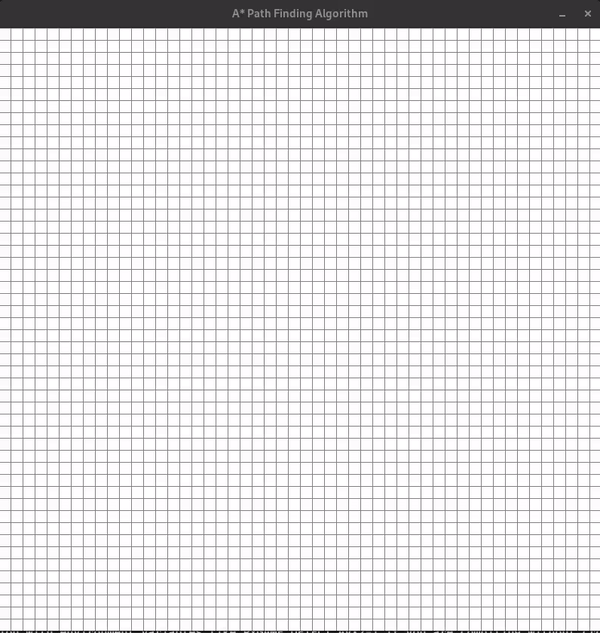

# Path finding algorithms visualizations

This project is a visualization of the most common path finding algorithms. The algorithms are implemented in Python and the visualization is done using Pygame.
    - Dijkstra's algorithm
    - A* algorithm

## How to run the project
1. Clone the repository
2. Install the required packages
   - pygame
3. Run the respective python file for the algorithm you want to visualize
   - Dijkstra's algorithm: `python dijkstra.py`
   - A* algorithm: `python astar.py`

## How to use the visualization
- Left click on a node(cell) to set the start node, then left click on another node to set the end node
- Left click on a node to create a wall, right click on a node to remove a wall
- Press the space bar to start the visualization
- Press the 'c' key to clear the grid and start over
- Press the 'r' key to change all the node to black(can be  useful for visualizing mazes)

## Screenshots
- Dijkstra's algorithm

- A* algorithm
